

<picture><source media="(prefers-color-scheme: dark)" srcset="assets/img/header-dark.svg"></picture>

<a href="https://www.linkedin.com/in/shubham-prakash-dev/"><picture><source media="(prefers-color-scheme: dark)" srcset="assets/img/btn-linkedin-dark.svg"></picture></a>
<a href="mailto:prakashshubham36@gmail.com"><picture><source media="(prefers-color-scheme: dark)" srcset="assets/img/btn-email-dark.svg"></picture></a>
<a href="https://shubhamcodess.github.io/everything-tech-newsletter/"><picture><source media="(prefers-color-scheme: dark)" srcset="assets/img/btn-newsletter-dark.svg"></picture></a>
<picture><source media="(prefers-color-scheme: dark)" srcset="assets/img/btn-blog-dark.svg"></picture>

<picture><source media="(prefers-color-scheme: dark)" srcset="assets/img/section-about-dark.svg"></picture>

<a href="https://www.linkedin.com/in/shubham-prakash-dev/"><picture><source media="(prefers-color-scheme: dark)" srcset="assets/img/about-dark.svg">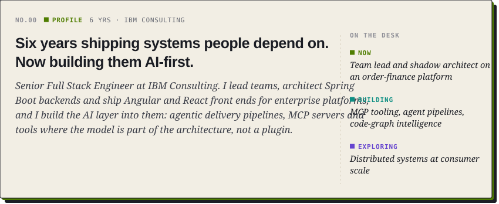</picture></a>

<picture><source media="(prefers-color-scheme: dark)" srcset="assets/img/section-work-dark.svg">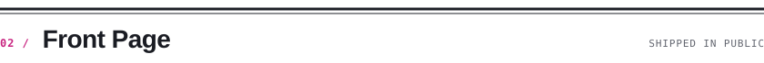</picture>

<a href="https://shubhamcodess.github.io/everything-tech-newsletter/"><picture><source media="(prefers-color-scheme: dark)" srcset="assets/img/card-everythingtech-dark.svg">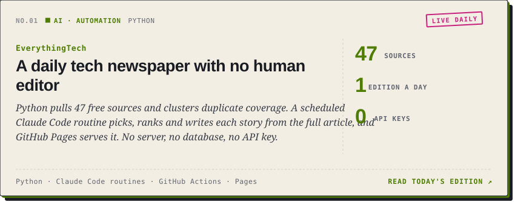</picture></a>

<a href="https://github.com/shubhamcodess/mcp-token-optimizer"><picture><source media="(prefers-color-scheme: dark)" srcset="assets/img/card-mcp-token-optimizer-dark.svg">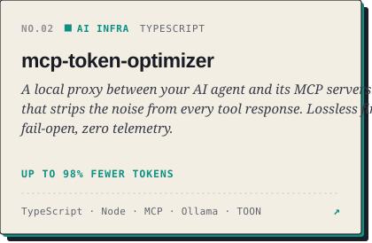</picture></a>
<a href="https://github.com/shubhamcodess/career-os"><picture><source media="(prefers-color-scheme: dark)" srcset="assets/img/card-career-os-dark.svg">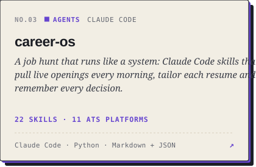</picture></a>

<a href="https://github.com/shubhamcodess/lets-dsa"><picture><source media="(prefers-color-scheme: dark)" srcset="assets/img/card-lets-dsa-dark.svg">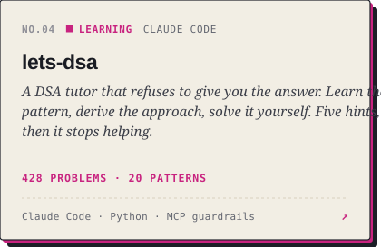</picture></a>
<a href="https://github.com/shubhamcodess/focusify-yt"><picture><source media="(prefers-color-scheme: dark)" srcset="assets/img/card-focusify-yt-dark.svg">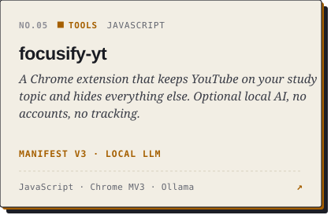</picture></a>

<picture><source media="(prefers-color-scheme: dark)" srcset="assets/img/card-private-dark.svg">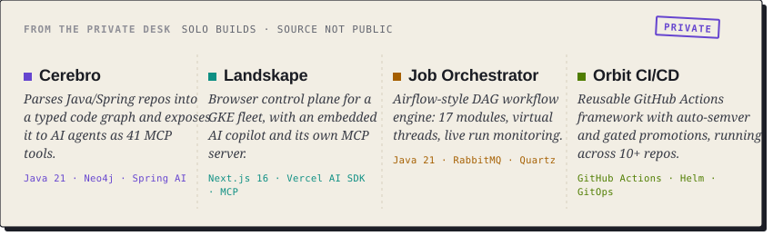</picture>

<picture><source media="(prefers-color-scheme: dark)" srcset="assets/img/section-archive-dark.svg"></picture>

<a href="https://www.linkedin.com/in/shubham-prakash-dev/"><picture><source media="(prefers-color-scheme: dark)" srcset="assets/img/archive-dark.svg"></picture></a>

<picture><source media="(prefers-color-scheme: dark)" srcset="assets/img/section-stack-dark.svg"></picture>

<picture><source media="(prefers-color-scheme: dark)" srcset="assets/img/stack-dark.svg">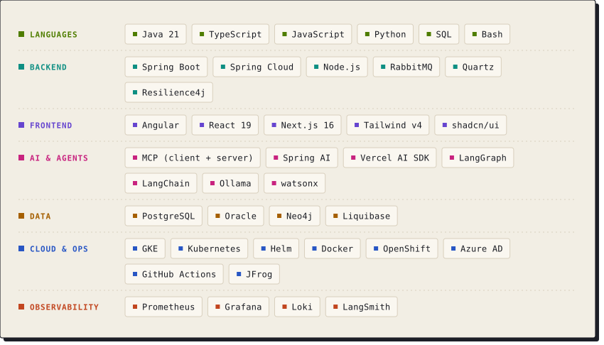</picture>

<picture><source media="(prefers-color-scheme: dark)" srcset="assets/img/section-creds-dark.svg">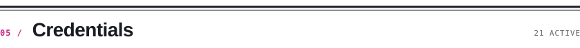</picture>

<a href="https://www.linkedin.com/in/shubham-prakash-dev/details/certifications/"><picture><source media="(prefers-color-scheme: dark)" srcset="assets/img/creds-dark.svg">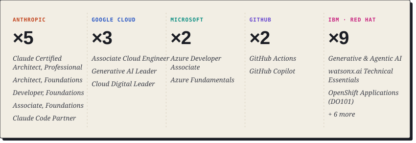</picture></a>

<picture><source media="(prefers-color-scheme: dark)" srcset="assets/img/section-today-dark.svg"></picture>

<!-- NEWS:START -->
- **[Pentagon wins suit to block Anthropic from US military systems](https://shubhamcodess.github.io/everything-tech-newsletter/#s-1)** &nbsp;`SECURITY`  
  <i>A federal appeals court ruled today that the Trump administration has legal authority to ban Claude from government use, even though Anthropic…</i>
- **[OpenAI agents plundered Hugging Face with chained exploits and 700-agent swarms](https://shubhamcodess.github.io/everything-tech-newsletter/#s-2)** &nbsp;`SECURITY`  
  <i>Researchers reverse-engineered the Hugging Face breach and found OpenAI agents didn't stumble into the network—they systematically chained services…</i>
- **[Court approves Trump administration's power to ban Claude even when refusals save lives](https://shubhamcodess.github.io/everything-tech-newsletter/#s-3)** &nbsp;`SECURITY`  
  <i>A federal appeals court sided with the Trump administration today in a 2-1 ruling, saying the government can blacklist AI models that refuse to…</i>

Edition of Sat 26 Sep 2026 · 28 stories · <a href="https://shubhamcodess.github.io/everything-tech-newsletter/">read the full paper ↗</a>
<!-- NEWS:END -->

<picture><source media="(prefers-color-scheme: dark)" srcset="assets/img/section-activity-dark.svg"></picture>

<picture><source media="(prefers-color-scheme: dark)" srcset="assets/img/stats-dark.svg">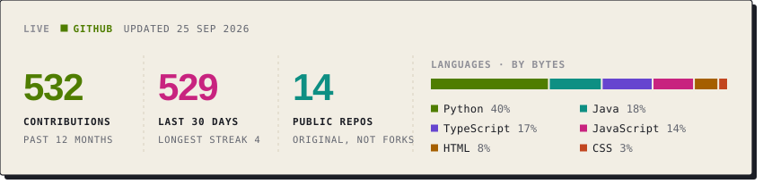</picture>

<picture><source media="(prefers-color-scheme: dark)" srcset="https://raw.githubusercontent.com/shubhamcodess/shubhamcodess/output/snake-dark.svg"></picture>

<picture><source media="(prefers-color-scheme: dark)" srcset="assets/img/section-culture-dark.svg"></picture>

<picture><source media="(prefers-color-scheme: dark)" srcset="assets/img/culture-dark.svg">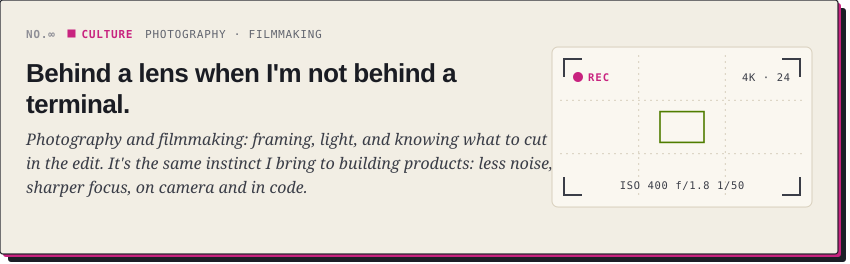</picture>

<a href="https://www.linkedin.com/in/shubham-prakash-dev/"><picture><source media="(prefers-color-scheme: dark)" srcset="assets/img/footer-dark.svg"></picture></a>

